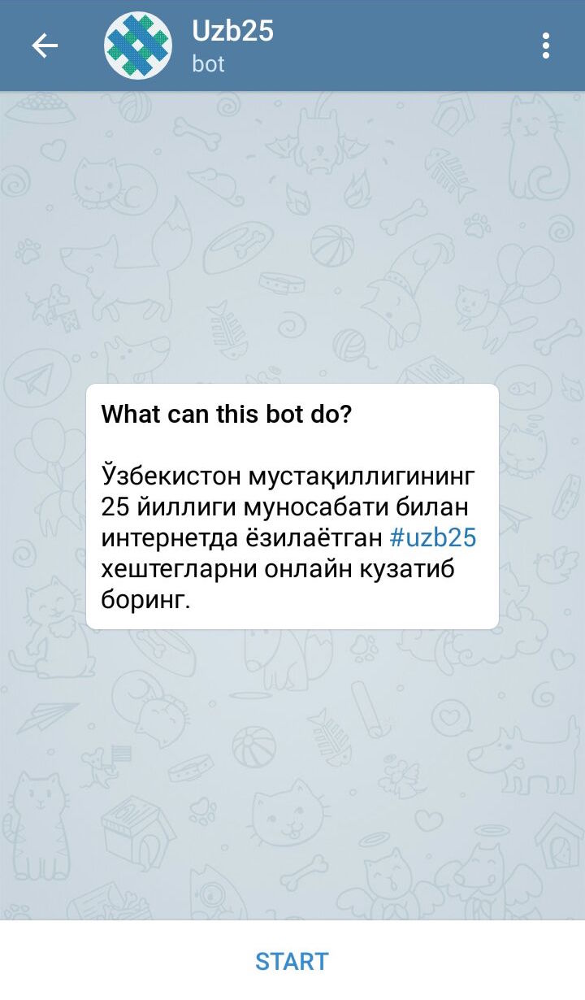
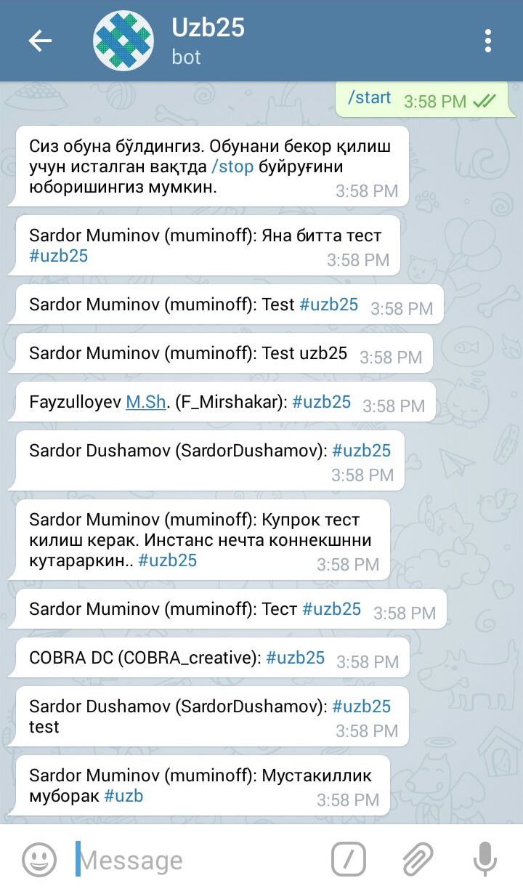

# uzb25bot
Ўзбекистон мустақиллигининг 25 йиллиги муносабати билан интернетда ёзилаётган #uzb25 хештегларни онлайн кузатиб боринг.

Телеграм бот: [@Uzb25Bot](https://telegram.me/Uzb25Bot)

# Ўрнатиш тартиби
Ушбу буйруқларни кетма-кетликда ишга туширинг.

1. `brew install node`
2. `git clone https://github.com/muminoff/uzb25bot`
3. `cd uzb25 && npm install`
4. `createuser -s uzb25`
5. `createdb -O uzb25 uzb25`
6. `psql -U uzb25 < schema/subscribers.sql`
7. `psql -U uzb25 < schema/functions.sql`
8. `psql -U uzb25 < schema/tweets.sql`
9. `EXPORT DATABASE_URL="postgres://uzb25@localhost/uzb25"`
10. `EXPORT TELEGRAM_TOKEN="__telegram_token__"`
11. `EXPORT TWITTER_CONSUMER_KEY="__twitter_consumer_key__"`
12. `EXPORT TWITTER_CONSUMER_SECRET="__twitter_consumer_secret__"`
13. `EXPORT TWITTER_ACCESS_TOKEN_KEY="__twitter_access_token_key__"`
14. `EXPORT TWITTER_ACCESS_TOKEN_SECRET="__twitter_access_token_secret__"`
15. `npm start`

# Лицензия
MIT
